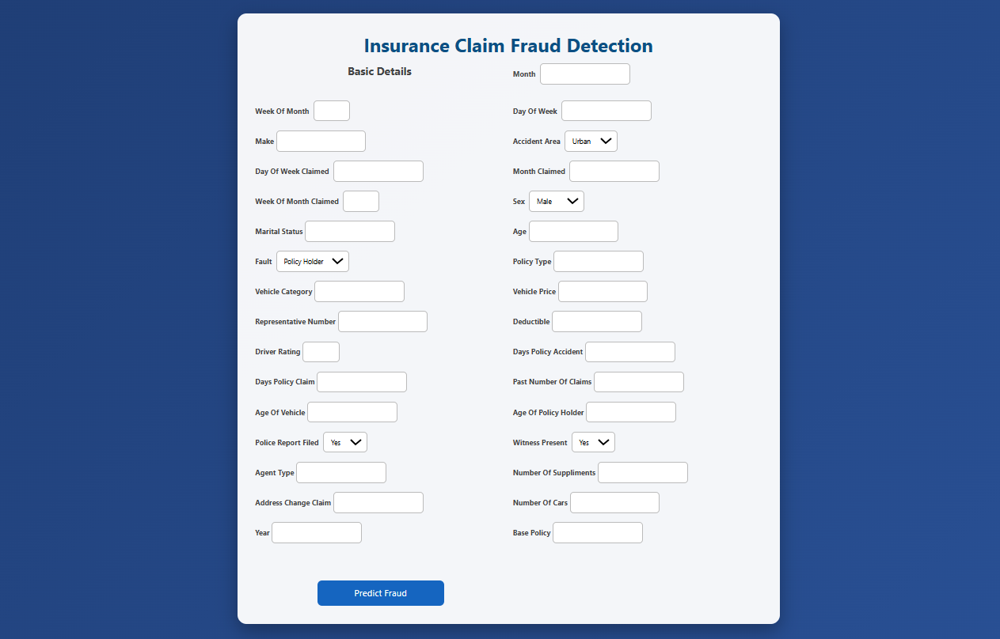
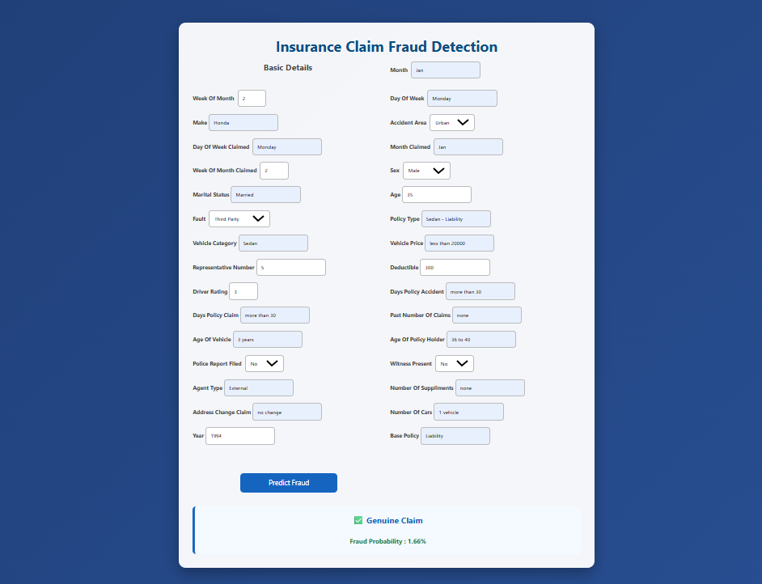
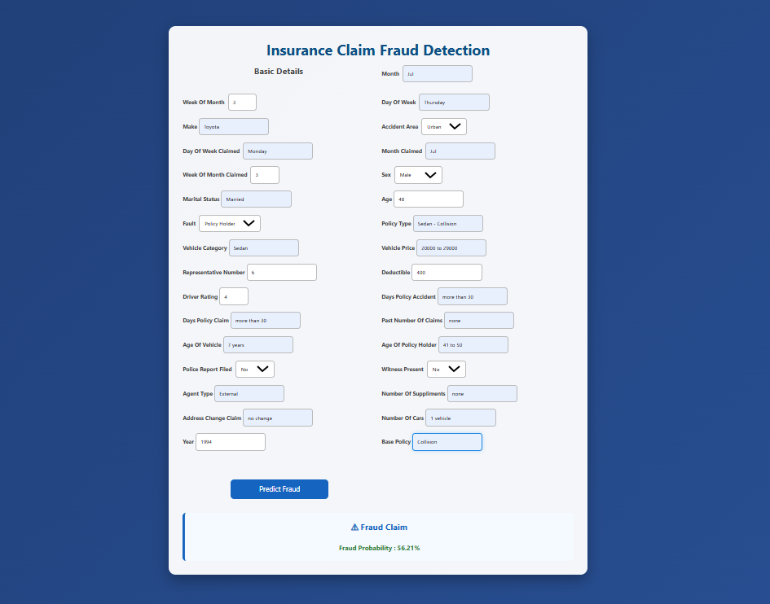

# Insurance Claim Fraud Detection using Machine Learning
This project predicts whether an insurance claim is "Genuine" or "Fraudulent" using Machine Learning.
The project covers the complete machine learning workflow, including data preprocessing, handling imbalanced data using SMOTE, model training, hyperparameter tuning, and deployment with Flask.

## Features
- Data Cleaning and Preprocessing
- One-Hot Encoding
- SMOTE for Class Imbalance
- Logistic Regression
- Decision Tree
- K-Nearest Neighbors (KNN)
- Hyperparameter Tuning using GridSearchCV
- Model Evaluation
- Flask Web Application
- Fraud Prediction with Probability

## Technologies Used

- Python
- Pandas
- NumPy
- Scikit-learn
- Flask
- HTML
- CSS
- Joblib

## Project Structure
Insurance_Claim_Fraud_Detection/
    - app/
    - dataset/
    - models/
    - notebook/
    - screenshots/
    - README.md
    - requirements.txt
    - .gitignore

## Model Performance
Logistic Regression
- Accuracy= 63.52%
- Recall= 90.27%  

Decision Tree
- Accuracy= 70.10%
- Recall= 75.68% 

KNN
- Accuracy= 66.44%%
- Recall= 62.70%

Selected Model: Logistic Regression - The model was selected because it achieved the highest recall, which is important for identifying fraudulent insurance claims.

## Screenshots

### Home Page

### Prediction Result

## How to Run
### 1. Clone the Repository
git clone https://github.com/JemishaGhori/Insurance-Claim-Fraud-Detection.git

### 2. Navigate to the Project Folder
cd Insurance-Claim-Fraud-Detection

### 3: Install the Required Libraries
pip install -r requirements.txt

### 4: Run the Flask Application
cd app
python app.py

### 5: Open the Application
Open your browser and visit:
http://127.0.0.1:5000

## Future Improvements

- Improve the user interface
- Deploy the application online
- Experiment with advanced machine learning models

## Author

Jemisha Ghori

